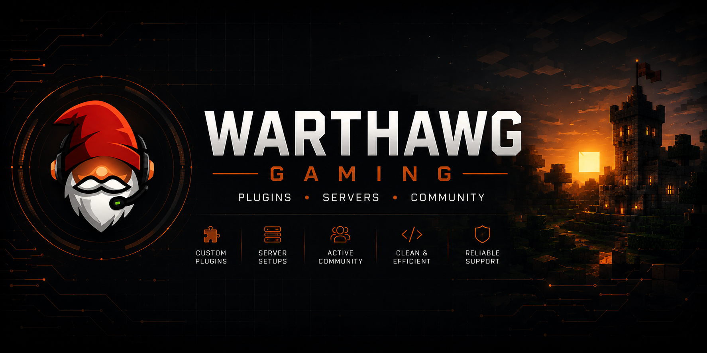

  

# Warthawg Gaming

Gaming creator, Minecraft server developer, and plugin creator.

---

## About Me

I build Minecraft Java server projects, custom plugins, gaming communities, and content centered around Warthawg Gaming.

Current focus areas include:

- Minecraft Java server development
- Custom Paper / Spigot plugins
- Gaming community projects
- Farming Simulator content
- Star Trek Online gameplay
- GitHub Pages development

---

## Featured Projects

### Website
- [WarthawgGaming.com](https://warthawggaming.com)
- [GitHub Pages Repository](https://github.com/WarthawgGaming/warthawggaming.github.io)

### Minecraft Plugins
- [InventoryTools](https://github.com/WarthawgGaming/InventoryTools)
- [AutoHopper](https://github.com/WarthawgGaming/autohopper)
- [Plugin Collection](https://github.com/WarthawgGaming/warthawggaming-plugins)
- [Minecraft Plugin Template](https://github.com/WarthawgGaming/minecraft-plugin-template)

### Server Development
- [Warthawg Gaming Server](https://github.com/WarthawgGaming/warthawggaming-server)
- [Plugin Ideas](https://github.com/WarthawgGaming/plugin-ideas)

---

## Current Development Focus

- Minecraft Java server infrastructure
- Plugin systems and utilities
- Inventory management plugins
- Gameplay quality-of-life improvements
- Community tools and automation
- Website and GitHub ecosystem improvements

---

## Plugin Ecosystem

Current plugin development includes:

- InventoryTools
- AutoHopper
- Shared plugin utilities
- Plugin templates and frameworks
- Future server automation systems

---

## Connect With Me

- Website: https://warthawggaming.com
- Twitch: https://www.twitch.tv/warthawggaming
- Discord: https://discord.gg/SFKsPd8YjH
- GitHub: https://github.com/WarthawgGaming

---

## Tech Stack

- Java
- Paper / Spigot API
- GitHub Pages
- HTML / CSS
- Minecraft Server Development

---

## Status

Actively building plugins, server tools, and gaming community systems.
